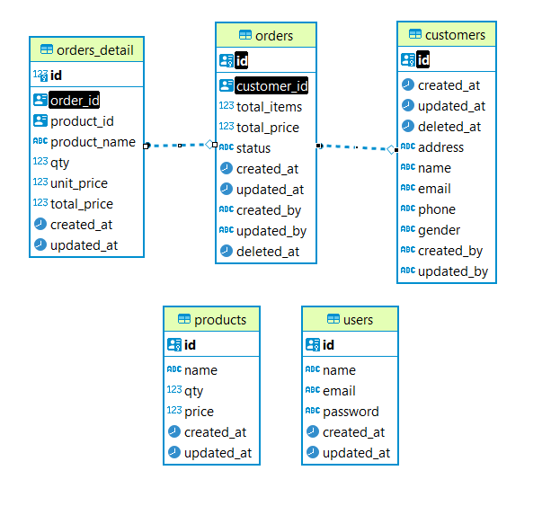
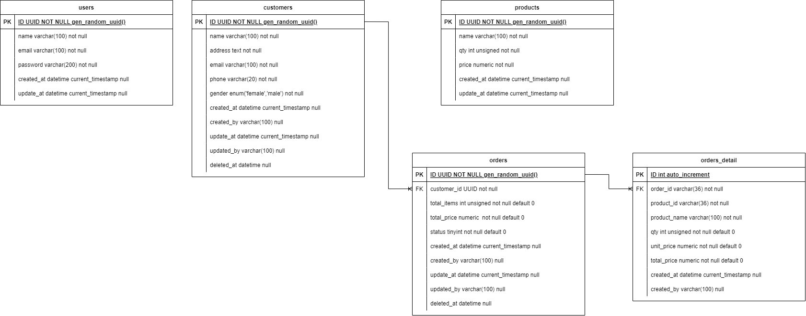

# BE - DBO
This repository contains the API Order Management project for the technical test using Golang. 
The project provides CRUD operations for managing customers and orders, the ability to get a list of products, and functionalities to register and login users. 
For debugging purposes, the system does not use role-based access control (RBAC) and allows access to customer and order management using JWT authentication.
* The /api/register and /api/login endpoints handle user registration and login, respectively, and provide the JWT token needed for authentication.

* The customer and order management endpoints require users to include the JWT token in the Authorization header for successful access.

* The /api/products endpoint allows users to retrieve a list of all products without the need for JWT authentication.

## Entity-Relationship Diagram (ERD)
The ERD illustrates the relationships between the entities (tables) in the database for the API Order Management project.



## Table



## Installation and Setup
1. Clone the repository:
```bash
git clone https://github.com/siskastev/be-dbo.git
```
2. Navigate to the project directory:
```bash
cd be-dbo
```
3. Rename or copy .env.example to .env
4. Run Docker Compose Up for running system with docker
```bash
docker-compose up
```
5. can access `api-doc.json` to testing

## API Documentation
The API documentation for the API Order Management project is provided in the `api-doc.json` file. 
This file allows you to quickly test the API endpoints when the Docker container is running. 
You can use various API testing tools or utilities to interact with the API and view the responses for each endpoint.
